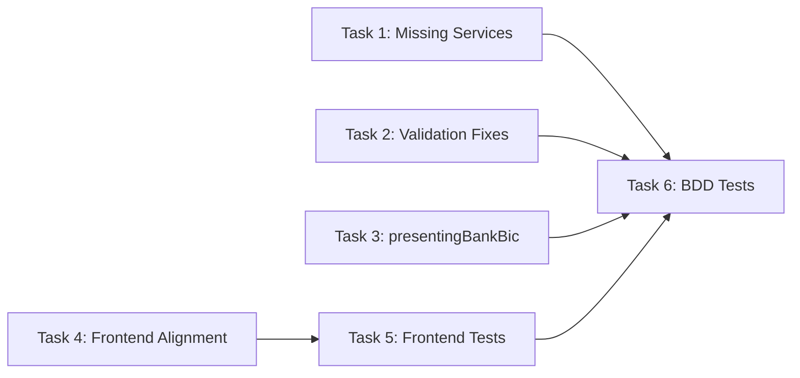

# Fix TradeParty Refactor Code Review Issues

All issues from [code_review_tradeparty_refactor.md](file:///Users/me/.gemini/antigravity/brain/76af994a-5a1f-4d42-acbd-1465c8a62235/code_review_tradeparty_refactor.md), organized into 6 tasks.

---

## Open Questions

> [!IMPORTANT]
> **SC-06 vs SC-11 contradiction:** The BRD (FR-TP-11) says "If role already assigned: updates the existing record with new partyId." But the current implementation rejects duplicates (PK constraint), and BDD SC-11 tests for rejection. Which behavior do you want?
> - **Option A (BRD):** `assign#InstrumentParty` uses `store#` (create-or-update). SC-11 test is updated to expect update behavior.
> - **Option B (Current):** Keep reject-on-duplicate. Update BRD FR-TP-11 and BDD SC-06 to match.
>
> **Plan below assumes Option A** (match the BRD). Will adjust after your input.

---

## Task 1: Missing Backend Services

Add the 3 services specified in the BRD but not yet implemented.

### [NEW] `update#TradeParty` — FR-TP-10

#### [MODIFY] [TradeCommonServices.xml](file:///Users/me/myprojects/moqui-trade/runtime/component/TradeFinance/service/trade/TradeCommonServices.xml)

Add service after `create#TradeParty` (after line ~410):

```xml
<service verb="update" noun="TradeParty" authenticate="false">
    <in-parameters>
        <parameter name="partyId" required="true"/>
        <auto-parameters entity-name="trade.TradeParty" include="nonpk"/>
        <!-- Bank-specific fields -->
        <parameter name="swiftBic"/>
        <parameter name="clearingCode"/>
        <parameter name="hasActiveRMA" type="Boolean"/>
        <parameter name="nostroAccountRef"/>
        <parameter name="fiLimitAvailable" type="BigDecimal"/>
        <parameter name="fiLimitCurrencyUomId"/>
    </in-parameters>
    <actions>
        <script>ec.artifactExecution.disableAuthz()</script>
        <entity-find-one entity-name="trade.TradeParty" value-field="party"/>
        <if condition="party == null">
            <return error="true" message="Party ${partyId} not found"/>
        </if>
        <set field="party" from="party.setAll(context)"/>
        <entity-update value-field="party"/>
        
        <if condition="party.partyTypeEnumId == 'PARTY_BANK'">
            <entity-find-one entity-name="trade.TradePartyBank" value-field="bank"/>
            <if condition="bank != null">
                <set field="bank" from="bank.setAll(context)"/>
                <if condition="hasActiveRMA != null">
                    <set field="bank.hasActiveRMA" from="hasActiveRMA ? 'Y' : 'N'"/>
                </if>
                <entity-update value-field="bank"/>
            </if>
        </if>
    </actions>
</service>
```

### [NEW] `remove#InstrumentParty` — FR-TP-11

Add service after `assign#InstrumentParty`:

```xml
<service verb="remove" noun="InstrumentParty" authenticate="false">
    <in-parameters>
        <parameter name="instrumentId" required="true"/>
        <parameter name="roleEnumId" required="true"/>
    </in-parameters>
    <actions>
        <script>ec.artifactExecution.disableAuthz()</script>
        <entity-find-one entity-name="trade.TradeInstrumentParty" value-field="junc"/>
        <if condition="junc == null">
            <return error="true" message="No party assigned for role ${roleEnumId} on instrument ${instrumentId}"/>
        </if>
        <entity-delete value-field="junc"/>
    </actions>
</service>
```

### [NEW] `get#InstrumentParties` — FR-TP-11

Add service after `remove#InstrumentParty`:

```xml
<service verb="get" noun="InstrumentParties" authenticate="false">
    <in-parameters>
        <parameter name="instrumentId" required="true"/>
    </in-parameters>
    <out-parameters>
        <parameter name="partyList" type="List"><parameter name="party" type="Map"/></parameter>
    </out-parameters>
    <actions>
        <script>ec.artifactExecution.disableAuthz()</script>
        <entity-find entity-name="trade.TradeInstrumentParty" list="juncList">
            <econdition field-name="instrumentId"/>
        </entity-find>
        <set field="partyList" from="[]"/>
        <iterate list="juncList" entry="junc">
            <entity-find-one entity-name="trade.TradePartyView" value-field="partyView">
                <field-map field-name="partyId" from="junc.partyId"/>
            </entity-find-one>
            <script>partyList.add(junc.getMap() + (partyView?.getMap() ?: [:]))</script>
        </iterate>
    </actions>
</service>
```

---

## Task 2: Fix `assign#InstrumentParty` Validation Gaps

Two gaps in the existing service.

#### [MODIFY] [TradeCommonServices.xml](file:///Users/me/myprojects/moqui-trade/runtime/component/TradeFinance/service/trade/TradeCommonServices.xml)

**Change 1 — Add party-type validation** (after line 424, before bank eligibility checks):

```xml
<!-- Validate party type matches role requirements -->
<set field="bankRoles" from="['TP_ISSUING_BANK', 'TP_APPLICANT_BANK', 'TP_ADVISING_BANK', 
    'TP_ADVISE_THROUGH_BANK', 'TP_CONFIRMING_BANK', 'TP_REIMBURSING_BANK', 
    'TP_NEGOTIATING_BANK', 'TP_DRAWEE_BANK', 'TP_PRESENTING_BANK',
    'TP_INTERMEDIARY_BANK', 'TP_SENDERS_CORRESPONDENT', 'TP_RECEIVERS_CORRESPONDENT']"/>
<set field="commercialRoles" from="['TP_APPLICANT', 'TP_BENEFICIARY']"/>

<if condition="bankRoles.contains(roleEnumId) &amp;&amp; party.partyTypeEnumId != 'PARTY_BANK'">
    <return error="true" message="Role ${roleEnumId} requires a Bank party."/>
</if>
<if condition="commercialRoles.contains(roleEnumId) &amp;&amp; party.partyTypeEnumId != 'PARTY_COMMERCIAL'">
    <return error="true" message="Role ${roleEnumId} requires a Commercial party."/>
</if>
```

**Change 2 — Switch from `create#` to `store#`** (line 456):

Replace:
```xml
<service-call name="create#trade.TradeInstrumentParty" in-map="context"/>
```
With:
```xml
<service-call name="store#trade.TradeInstrumentParty" in-map="context"/>
```

This implements BRD FR-TP-11 update-on-reassign behavior. `store#` creates if not exists, updates if PK match found.

---

## Task 3: Remove `presentingBankBic` Flat Field — FR-TP-08

#### [MODIFY] [ImportLcEntities.xml](file:///Users/me/myprojects/moqui-trade/runtime/component/TradeFinance/entity/ImportLcEntities.xml)

Remove line 102:
```xml
<field name="presentingBankBic" type="text-medium"/>
```

#### [MODIFY] [SwiftGenerationServices.xml](file:///Users/me/myprojects/moqui-trade/runtime/component/TradeFinance/service/trade/SwiftGenerationServices.xml)

Lines 280 and 397 still read `pres.presentingBankBic`. Replace with junction-based lookup (same pattern already used at lines 324/367):

```groovy
// Replace: pres.presentingBankBic ?: "BENEBANK"
// With:    getPartyBic("TP_PRESENTING_BANK") ?: "BENEBANK"
```

#### [MODIFY] [ImportLcEntitiesSpec.groovy](file:///Users/me/myprojects/moqui-trade/runtime/component/TradeFinance/src/test/groovy/trade/ImportLcEntitiesSpec.groovy)

Line 280: Update the test that persists `presentingBankBic` to instead create a `TP_PRESENTING_BANK` junction record and verify retrieval via junction.

---

## Task 4: Frontend Alignment

### [MODIFY] [types.ts](file:///Users/me/myprojects/moqui-trade/frontend/src/api/types.ts)

6 changes in one file:

1. **Line 125:** Remove duplicate `swiftBic?` declaration (already on line 115)
2. **Line 127:** Remove stale `partyRoleEnumId?` field
3. **Lines 114, 117-122:** Remove legacy fields that don't exist on entity: `roleTypeId`, `address1`, `city`, `countryGeoId`, `kycStatusEnumId`, `sanctionsStatusEnumId`, `riskRating`, `description`
4. **Lines 79-84:** Remove flat BIC fields from `ImportLetterOfCredit` interface: `issuingBankBic`, `advisingBankBic`, `advisingThroughBankBic`, `availableWithBic`, `draweeBankBic`
5. **Lines 92-93:** Remove stale `applicantName`, `beneficiaryName` (now `applicantPartyName`, `beneficiaryPartyName` from view entity)

### [MODIFY] [IssuanceStepper.tsx](file:///Users/me/myprojects/moqui-trade/frontend/src/components/IssuanceStepper.tsx)

**Line 598:** Applicant dropdown uses `parties.map(...)` — change to `commercialParties.map(...)` to match BRD rule that `TP_APPLICANT` requires `PARTY_COMMERCIAL`.

### [MODIFY] [TradeCommonServices.xml](file:///Users/me/myprojects/moqui-trade/runtime/component/TradeFinance/service/trade/TradeCommonServices.xml)

**Line 392:** Simplify dead ternary:
```xml
<!-- Before -->
partyTypeEnumId == 'PARTY_BANK' ? 'PtyOrganization' : 'PtyOrganization'
<!-- After -->
'PtyOrganization'
```

---

## Task 5: Fix Frontend Test Mock Data

3 test files have stale mock shapes that don't match the post-refactor API contract.

### [MODIFY] [ImportLcDashboard.test.tsx](file:///Users/me/myprojects/moqui-trade/frontend/src/components/ImportLcDashboard.test.tsx)

Lines 14-15: Replace `applicantName`/`beneficiaryName` with `applicantPartyName`/`beneficiaryPartyName` to match `ImportLetterOfCreditView` aliases.

### [MODIFY] [AmendmentStepper.test.tsx](file:///Users/me/myprojects/moqui-trade/frontend/src/components/AmendmentStepper.test.tsx)

Line 12: Remove `beneficiaryPartyId: 'PARTY_EXP_1'` (flat field no longer on entity). Add `parties` array if the component reads from it.

### [MODIFY] [SettlementForm.test.tsx](file:///Users/me/myprojects/moqui-trade/frontend/src/components/SettlementForm.test.tsx)

Line 15: Replace `beneficiaryName` with `beneficiaryPartyName` (or `parties` array, depending on how the component reads it).

### [MODIFY] [SwiftValidationSpec.groovy](file:///Users/me/myprojects/moqui-trade/runtime/component/TradeFinance/src/test/groovy/trade/SwiftValidationSpec.groovy)

Lines 283-284: Remove dead `applicantName`/`beneficiaryName` params from `create#ImportLetterOfCredit` call. They're ignored by the backend — just noise.

---

## Task 6: Expand BDD Test Coverage

Current: 7/17 scenarios. Target: 17/17.

### [MODIFY] [TradePartySpec.groovy](file:///Users/me/myprojects/moqui-trade/runtime/component/TradeFinance/src/test/groovy/trade/TradePartySpec.groovy)

Add the following test scenarios:

| Scenario | Description | Tests |
|:---|:---|:---|
| SC-03 | SWIFT char validation on `create#TradeParty` | Reject `partyName` with `&` and `@` chars |
| SC-05 | Same bank → multiple roles on one instrument | Assign JPM as Advising + Confirming + Reimbursing |
| SC-07 | Commercial party → bank role rejection | Assign `PARTY_COMMERCIAL` to `TP_ADVISING_BANK` → error |
| SC-09 | Advising bank without RMA allowed when advise-through exists | Assign no-RMA bank as Advising after assigning through-bank |
| SC-11 | **Update:** Role reassignment updates (not rejects) | Change from reject test to update-on-reassign test (per Option A) |

### [NEW] [TradePartyLcIntegrationSpec.groovy](file:///Users/me/myprojects/moqui-trade/runtime/component/TradeFinance/src/test/groovy/trade/TradePartyLcIntegrationSpec.groovy)

> [!NOTE]
> This file already exists but may need scenarios added. If it's empty or stub, populate with:

| Scenario | Description |
|:---|:---|
| SC-12 | Create Import LC with structured party assignments — verify junction records |
| SC-13 | Select ANY BANK — verify `availableWithEnumId` and no `TP_NEGOTIATING_BANK` junction |
| SC-14 | Switch from specific bank to ANY BANK — verify junction record removed |
| SC-15 | Submit LC missing mandatory role (no beneficiary) → validation error |
| SC-16 | Submit LC with expired KYC on advising bank → validation error |
| SC-17 | Query `ImportLetterOfCreditView` — verify `applicantPartyName` / `beneficiaryPartyName` resolved from junction |

---

## Verification Plan

### Automated Tests

```bash
# Backend: Run full Spock suite
./gradlew test

# Frontend: Run Jest tests
cd frontend && npm test -- --watchAll=false

# Frontend: Run Playwright E2E (if applicable)
cd frontend && npx playwright test
```

### Manual Verification

1. After Task 2: Manually test `assign#InstrumentParty` with a commercial party for a bank role — expect rejection
2. After Task 3: Generate an MT750 message for a presentation — verify it reads presenting bank BIC from junction
3. After Task 4: Load the IssuanceStepper in browser — verify Applicant dropdown only shows commercial parties
4. After Task 6: All 17 BDD scenarios passing in `TradePartySpec` + `TradePartyLcIntegrationSpec`

---

## Dependency Order



Tasks 1-4 are independent and can be parallelized. Task 5 depends on Task 4 (types changes). Task 6 depends on Tasks 1-3 (new services and validation needed for test scenarios).
